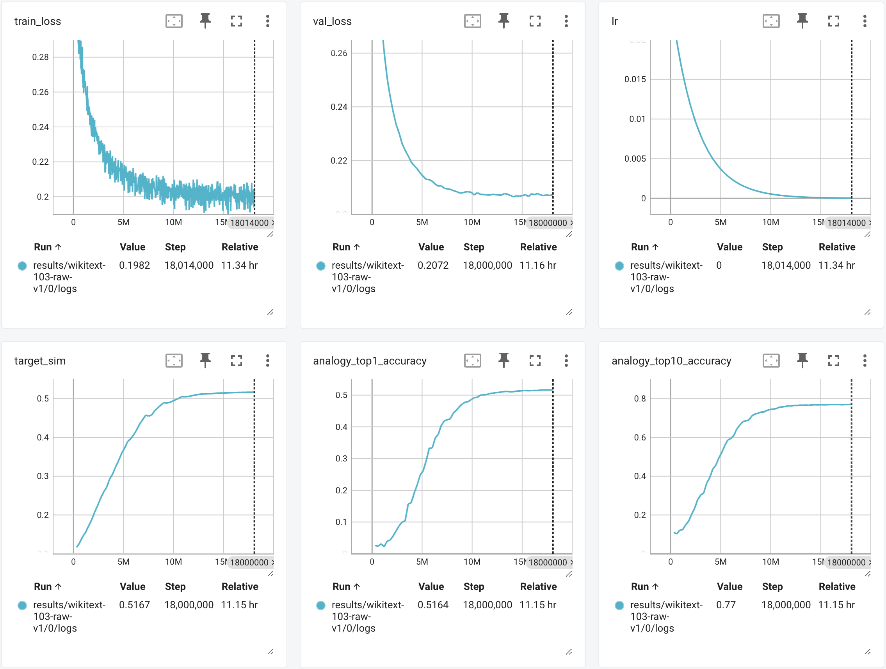

# A PyTorch Implementation of Word2Vec (Skip-gram)

This is a PyTorch implementation of Word2Vec algorithm (skip-gram with negative sampling) introduced by Mikolov et al in [Distributed Representations of Words and Phrases and their Compositionality](https://proceedings.neurips.cc/paper_files/paper/2013/file/9aa42b31882ec039965f3c4923ce901b-Paper.pdf).

Trained on [wikitext-103-raw-v1](https://huggingface.co/datasets/Salesforce/wikitext) for 10 epochs (11.34 hours), it achieves 51.64% accuracy on the [word2vec analogy test set](https://huggingface.co/datasets/tomasmcz/word2vec_analogy).

